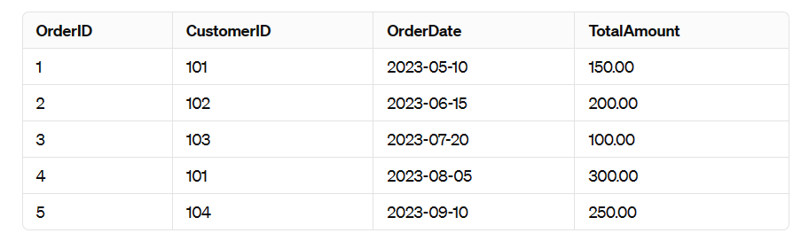
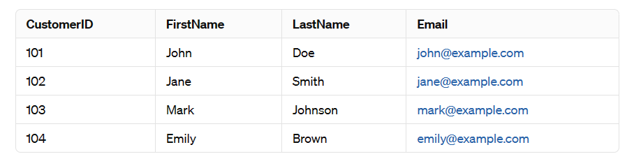

# SQLInteract: Text To SQL App

This project is aimed at developing a Text to SQL Language Learning Model (LLM) application along with querying a SQL database. The application will take natural language queries as input and convert them into SQL queries, allowing users to interact with a SQL database using plain English.

## Table of Contents

- [Introduction](#introduction)
- [Features](#features)
- [Installation](#installation)
- [Usage](#usage)
- [Outputs](#outputs)
- [Contributing](#contributing)
- [License](#license)

## Introduction

SQLInteract is an application designed to bridge the gap between natural language queries and SQL commands for interacting with databases. It allows users to input natural language questions or commands related to database queries and translates them into SQL queries to fetch the desired information from the connected database. This project aims to simplify the querying process for users who may not be familiar with SQL syntax but need to interact with databases.

## Features

- Convert natural language queries into SQL queries
- Query a SQL database using plain English
- Support for various SQL dialects (e.g., MySQL, PostgreSQL, SQLite)
- User-friendly interface for easy interaction

## Installation

To install and run this application, follow these steps:

1. Clone the repository: `git clone https://github.com/avinashkodali/Text-To-SQL-LLM-App.git`
2. Install the required dependencies: `pip install -r requirements.txt`
3. Set up the SQL database and configure the connection details in the application
4. Run the application: `python app.py`

## Usage

Once the application is running, you can access it through a web interface or a command-line interface. Simply enter your natural language query, and the application will convert it into an SQL query and execute it on the connected database.

## Outputs

Database:

Orders Table

Customers Table:

Here are some sample outputs of the application:

1. Natural Language Query: Retrieve the top 2 customers who have spent the most in total, along with their total spending amount.
  

2. Natural Language Query: List the orders made in the second quarter of 2023 (April 1, 2023, to June 30, 2023) along with the customer's full name, email address, and order total.

    

3. Natural Language Query: Identify the customers who have made orders totaling more than the average total amount spent by all customers. Display their full names and email addresses.

    

## Contributing

Contributions are welcome! If you would like to contribute to this project, please follow these steps:

1. Fork the repository
2. Create a new branch: `git checkout -b feature/your-feature-name`
3. Make your changes and commit them: `git commit -m 'Add some feature'`
4. Push to the branch: `git push origin feature/your-feature-name`
5. Submit a pull request

## License

This project is licensed under the [MIT License](LICENSE).